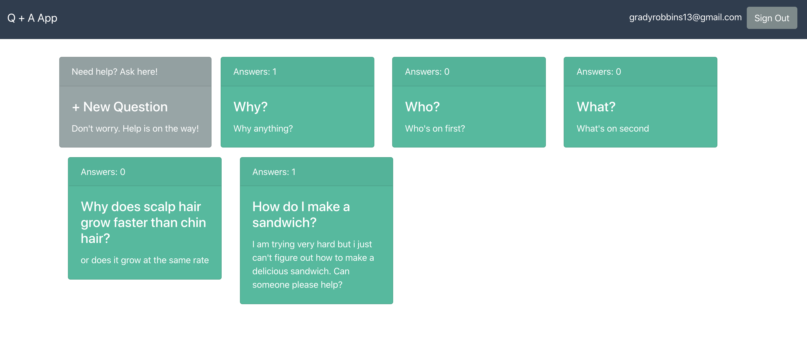

## This FULLSTACK Application was built by following a [tutorial](https://auth0.com/blog/react-tutorial-building-and-securing-your-first-app/)  by  [Bruno Krebs](https://auth0.com/blog/authors/bruno-krebs/)

:heavy_check_mark: FRONTEND using React to allow users to interact with one another, asking and answering questions

:heavy_check_mark: BACKEND API with Node.js and Express

:heavy_check_mark: AUTH0 technology to authenticate users 


## How to run this app:
### Open a terminal in your operating system, move to a directory where you create your projects, and issue the following commands:

```git clone https://github.com/gradyrobbins/AuthZero_Demo.git ```

```cd AuthZero_Demo```

```cd backend```

### use NPM to start the backend 
```npm install```

```node src``` should open http://localhost:8081 in your browser  

### navigate to AuthZero_Demo/frontend to run your React app

```cd ../frontend```

### start your React app
```npm install ```

```npm start```


## Conclusion 
This tutorial has been deprecated as it doesn't align with our latest product guidance, and will be retired on July 24th, 2020.  

The tutorial introduced a lot of different topics, I didn't really grasp all of them fully.  This was my first exposure to using Node.js and Express to create a backend API, and my first exposure to Auth0.  I barely touched the tip of the iceberg on some important concepts like the Component Lifecycle.  I know that React Hooks are a thing although I have not used them yet, myself.  Unfortunately, diving deep into these topics is not possible as it would make the article massive (more than it is already).  

Ultimately I hope to incorporate Auth0 into my front end capstone

